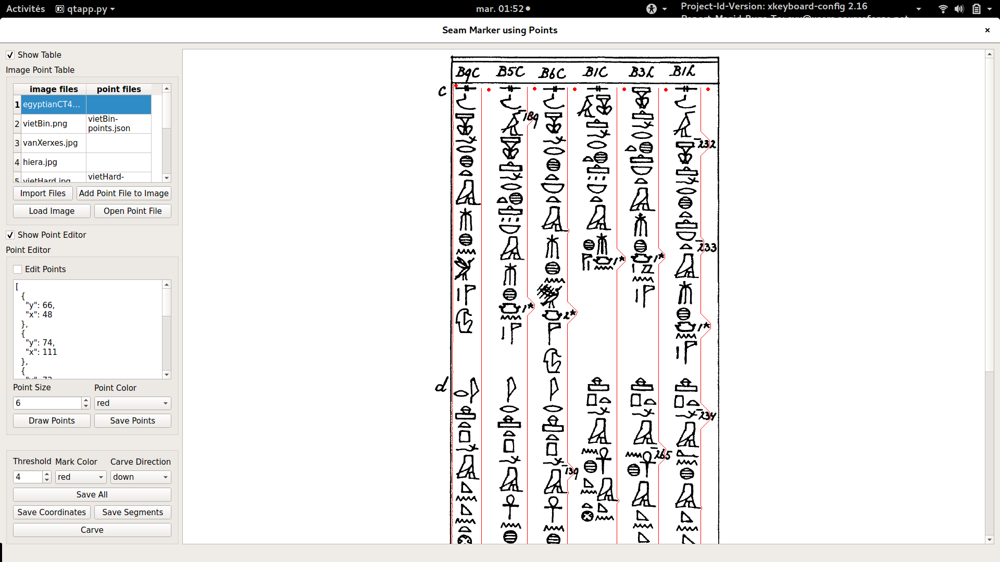

###########################################
Column Segmentation For Hieroglyphic Texts
###########################################

This example concerns column segmentation for hieroglyphic texts.

It is essentially no different than the other examples presented here.

The parameters of importance we had used to reproduce the segmentation
and coordinate are the following:

- Carve Direction: Down

- Threshold: 4

Here are the steps to reproduce:

- :code:`python qtapp.py`

- Click on :code:`Import Files`

- Select the image :code:`egyptianCT465.png` under the :code:`assets/images`
  directory of this folder

- Select the image in the :code:`Image Point Table`

- Click on :code:`Load Image`

- Click on :code:`Open Point File`

- Click on :code:`Draw Points`

- Enter the parameters mentioned above.

- Click on :code:`Carve`

- Click on :code:`Save All` if you want to save the point coordinates, mark
  coordinates and the areas that are between the coordinates
